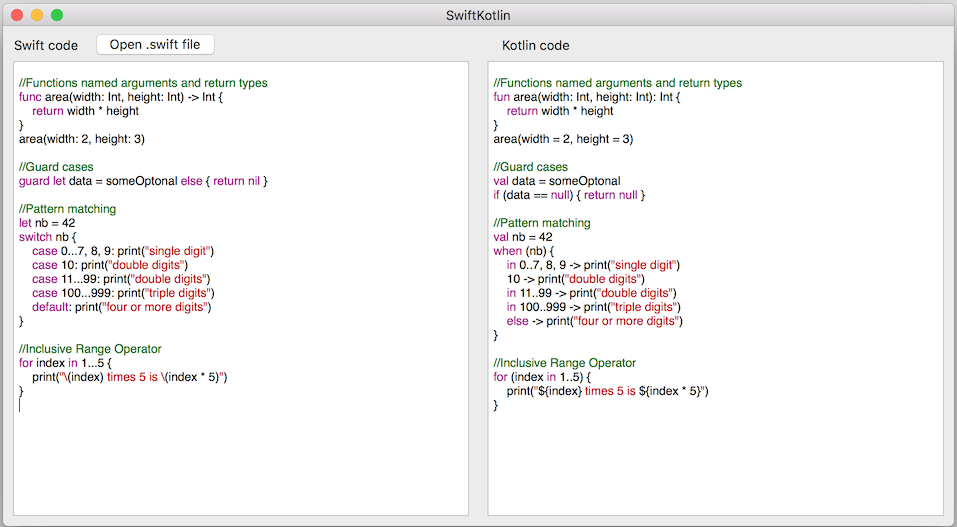

[](https://opensource.org/licenses/MIT)
[](http://twitter.com/angelolloqui)

# SwiftKotlin

A tool to convert Swift code to Kotlin in a very easy and quick way.



# What is this?

SwiftKotlin is a framework, a command line tool and a Mac application for **translating Swift code into Kotlin**.

It applies transformations to the Swift code to get as correct as possible Kotlin code (see limitations below). It does string transformations as well as some more complicated ones like transforming `guard` statements to negative `if` statements, properties, memory management and many others.

It comes with a desktop Mac application to copy & paste your code, as well as a command line tool to transform a complete project to Kotlin.


## Why use SwiftKotlin?

### Why Kotlin?
Kotlin is a great language, it is to Android/Java what Swift is to iOS/Objective-C. It adds lots of great features while at the same time it keeps complete interop with Java, which means that you can combine them both together as you prefer. 

**If you are a Swift developer**, you will love Kotlin. It provides the most important Swift features (optionals, extensions, generics, lambdas,...) and a very similar syntax. You can check a [side by side comparison of Swift and Kotlin here](https://nilhcem.github.io/swift-is-like-kotlin/).

**If you are a Java developer**, you will find in Kotlin a much more modern and safer language (optionals and mutation). It is a pleasure to write Kotlin code, much more readable and compact than the Java counterpart. You can check some of the [benefits and differences in Kotlin official documentation](https://kotlinlang.org/docs/reference/comparison-to-java.html) and a [nice list of reasons to chose Kotlin over Java](https://medium.freecodecamp.com/why-kotlin-is-my-next-programming-language-c25c001e26e3#.hjam7bscd).

Moreover, Kotlin is fully integrated in IntelliJ (Android Studio), so you can keep using the "de facto" IDE for Android with all the added benefits brought by Google, and it even has a Java to Kotlin converter if you want to update your legacy Java.

On top of that, if you consider the similarities between Swift and Kotlin, you can easily convert code in one language to the other one, and have Swift developers writing Kotlin (and *vice versa*) with ease. That is, in fact, the purpose of this project, to help you with that conversion.


### Benefits over shared code across platforms
There are many alternatives for making multiplatform projects or sharing code between them. Some alternatives are [Xamarin](https://www.xamarin.com/), [ReactNative](https://facebook.github.io/react-native/), [Cordova](https://cordova.apache.org/) or low level C++ libraries.

The main issue with all of them is that once you chose to use them, you need to keep in their boundaries, including specific tools and libraries, introducing a steep learning curve and a big risk in terms of dependency on that 3rd party. Besides that, for many of those options the resulting app will lack the quality of a fully native app.

On the other hand, by using Kotlin, you will still have 2 fully native applications, with all the benefits (best quality, performance, best tools per platform -Xcode/Android Studio-, follow platform conventions,...), but at the same time minimize the extra work required to translate between them due to the similarity with Swift. 

In fact, [I explored an actual example using MVVM+Rx](http://angelolloqui.com/blog/38-Swift-vs-Kotlin-for-real-iOS-Android-apps), where I got between a 50% and 90% of code similarity depending on the layer (non UIKit dependent is much more reusable than UIKit dependent classes of course). It took me around 30% the time to convert the Android version from the iOS version and I did not have SwiftKotlin then. ;)


## Limitations
Despite the similarities, Swift and Kotlin are different languages, with some intrinsic differences in them that cannot be fully translated. Besides that, they both run in different environments and have access to very different frameworks and system libraries.

Because of that, this **tool does not have as a goal to produce production ready Kotlin code**, but just a Kotlin translation that **will require manual editing**. For example, things as simple as adding a new item to an array have different method names:

```swift
// Swift
array.append("This is in Swift")
```
```kotlin
// Kotlin
array.add("This is in Kotlin")
```

The scope of this project is not mapping all existing methods and data types to their Kotlin counterpart, but to translate the language itself. This means that manual editing will be required afterwards, especially when dealing with system libraries. It is intentional and important that the developer checks the output.


## Status


The project is in active development, with many rules and improvements still to be implemented. Some of them include:

- [x] Constructors
- [x] Simple Control flow statments (`guard`, `if`, `for`, `while`, `switch`)
- [x] Composed Control flow statments (multiple `guard`, `if let`)
- [x] Extensions
- [x] Keyword replacements (`val`, `this`, `fun`, ...)
- [x] Basic memory management (`weak`, captures,...)
- [x] Function returns and named parameters
- [x] Basic property transfromers (getters and setters)
- [x] Lazy properties 
- [x] Properties with `didSet`/`willSet`
- [x] Static to Companion
- [x] Struct to data class
- [x] String interpolators
- [x] Foundation types (arrays, maps,...)
- [x] Basic exception handling syntax
- [x] Simple enums
- [x] Complex enum cases to Sealed classes
- [ ] ... [(check open issues)](https://github.com/angelolloqui/SwiftKotlin/issues)

With the implemented rules you can already get pretty decent Kotlin output for many of your classes. The rest will come in future releases.


## Installation

The project comes with 2 executable targets:

- **SwiftKotlinCommandLine**
- **SwiftKotlinApp**

Checkout the [project's releases page](https://github.com/angelolloqui/SwiftKotlin/releases) to get a preview compiled version of the app or compile it manually:

- Install Xcode 11+ and check it is the default selected one by running `xcode-select -p`
- clone the repo: `git clone git@github.com:angelolloqui/SwiftKotlin.git; cd SwiftKotlin`
- Run `swift package update` and `swift package generate-xcodeproj --enable-code-coverage`
- Open the project: `open SwiftKotlin.xcworkspace`

From Xcode, run the desired target and copy the generated executables (you can find it under the `Products` generated folder) in a directory with executable rights for later use. Typically, you could use:

- **swiftkotlin** command line tool: `/usr/local/bin/`
- **SwiftKotlinApp** desktop app: `/Applications/`

NOTE: If you upgrade any project dependencies, make sure you run:
`swift package generate-xcodeproj --enable-code-coverage` after upgrade

## Usage
### Command line tool
If you placed `swiftkotlin` in any of your path directories, just run: `swiftkotlin [<file>] [--output path]`

Note that you can specify a directory as input. Output will by default use the input directory, creating a `<name>.kt` file for each existing `<name>.swift` file found. 


## License

MIT licensed.

## Collaboration

Forks, patches and other feedback are always welcome.

For a list of missing features, check the disabled Unit Tests.


## Credits

SwiftKotlin uses [Swift-Transform](https://github.com/yanagiba/swift-transform) and [Swift-AST](https://github.com/yanagiba/swift-ast) for generating the AST for transpilation.

SwiftKotlin is brought to you by [Angel Garcia Olloqui](http://angelolloqui.com). You can contact me on:

- Project Page: [SwiftKotlin](https://github.com/angelolloqui/SwiftKotlin)
- Personal webpage: [angelolloqui.com](http://angelolloqui.com)
- Twitter: [@angelolloqui](http://twitter.com/angelolloqui)
- LinkedIn: [angelolloqui](http://www.linkedin.com/in/angelolloqui)

And special credits for the contributors:
- [Ryuichi Sai](https://github.com/ryuichis)
- [jonnermut](https://github.com/jonnermut)
- [Tomohiro Matsuzawa](https://github.com/thmatuza)
- [Tor Langballe](https://github.com/torlangballe)
- [Levi Dahlstrom](https://github.com/LeviDahl)
- [Shaurya](https://github.com/shaurya-ObjC)
